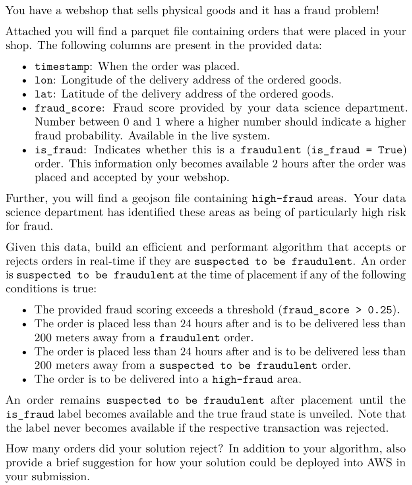

# Deterministic Fraud Detection Coding Challenge

# Solution
## System Requirements
The project was tested locally with 
* Docker v24.0.7 (running as `root` user)
* Docker Compose v2.23.3
* GNU Make v4.4.1
## Architecture
The algorithm is implemented as a FastAPI service leveraging Redis for data caching and geospatial search queries.
## Usage
### Run
```sh
make emulate-client
```
This will process the data from the `.parquet` file as well as print some statistics to `STDOUT`.
Sample output
```sh
...
Processed: 128000 (98.83%) | Rejected: 40746 (31.46%) | Accepted: 87254 (67.37%) | Time: 3m 9s
Processed: 129000 (99.61%) | Rejected: 41057 (31.70%) | Accepted: 87943 (67.90%) | Time: 3m 11s
Processed: 129511 (100.00%) | Rejected: 41265 (31.86%) | Accepted: 88246 (68.14%) | Time: 3m 12s
```
### Tear Down
```sh
make teardown
```
## AWS Deployment Suggestions
### Distribution
* Service is intended to be distributed through its Docker image via  ECR
* Client is provided as a `.whl` package to be used by other services via an in-house python package service like e.g. `devpi`
### AWS Setup
* The service can be deployed on an ECS cluster
* Redis cache can be set up through AWS Elasticache
* Additionally either a load balancer or a message queue can be put before the service depending on the traffic profile
* Logging can be facilitated either by CloudWatch, a custom Kibana setup, or both 
